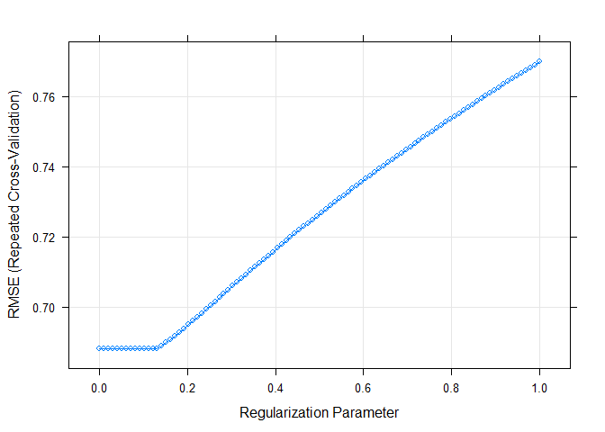
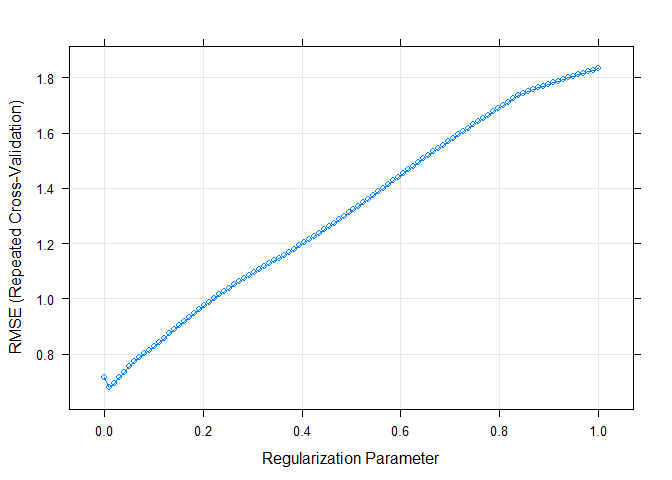
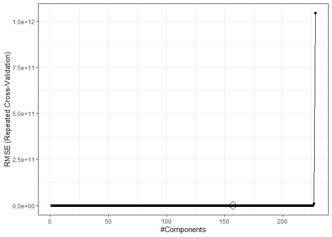

hw1
================
David DeStephano
February 25, 2020

``` r
library(RNHANES)
library(tidyverse)
library(summarytools)
library(stargazer)
library(leaps)
library(caret)
library(ModelMetrics)
library(pls)
```

Import the data
===============

``` r
test<-read_csv("solubility_test.csv")

train<-read_csv("solubility_train.csv")
```

``` r
#Linear Model
#fit_lm <-lm(Solubility~., data = train)
#pred_lm <-predict(fit_lm, test)
#mse(test$Solubility, pred_lm)
```

Preprocess data for ML
======================

``` r
x <-model.matrix(Solubility~.,train)[,-1]
y <- train$Solubility

# test data
x2 <-model.matrix(Solubility~.,test)[,-1]
y2 <- test$Solubility
```

``` r
preProcess(train)
```

    ## Created from 951 samples and 229 variables
    ## 
    ## Pre-processing:
    ##   - centered (229)
    ##   - ignored (0)
    ##   - scaled (229)

``` r
#trainDescr <- predict(xTrans, train)
#xTrans <- preProcess(trainDescr)
```

All variables are already centered and scaled

ctrl1 settings
==============

``` r
ctrl1 <-trainControl(method = "repeatedcv", number = 10, repeats = 5)

set.seed(2)


#ctrl1 <-trainControl(method = "none")
#Since we have a validation set already.. However this does not allow us to resample and check different values of lambda
```

Linear model using Caret
========================

``` r
lm.fit <-train(x, y, method = "lm",trControl = ctrl1)

predy2.lm <-predict(lm.fit, newdata = x2)

mse(y2, predy2.lm)
```

    ## [1] 0.5558898

The test MSE of the linear model is 0.5558898

Ridge regression
================

``` r
# ridge.fit <-train(x, y,
#                   method = "glmnet",
#                   tuneGrid =expand.grid(alpha = 0,
#                                         lambda=exp(seq(-1, 10, length=100))),
#                   #preProc = c("center","scale"),
#                   trControl = ctrl1)

ridge.fit <-train(x, y,
                  method = "glmnet",
                  tuneGrid =expand.grid(alpha = 0,
                                        lambda=seq(0.0001, 1, length=100)),
                  #preProc = c("center","scale"),
                  trControl = ctrl1)


predy2.ridge <-predict(ridge.fit, newdata = x2)

mse(y2, predy2.ridge)
```

    ## [1] 0.5134603

Checking paramters and best lambda value
----------------------------------------

``` r
#plot(ridge.fit, xTrans =function(x)log(x))
plot(ridge.fit, xTrans =function(x)(x))
```



``` r
ridge.fit$bestTune
```

    ##    alpha lambda
    ## 13     0 0.1213

``` r
#coef(ridge.fit$finalModel,ridge.fit$bestTune$lambda)
```

The test MSE of the ridge regression model is 0.5134603. The ideal lambda is 0.1213 when using cross validation. Before changing the grid of possible lambdas, the cross validated lambda was 0.3679, which is the same as exp(-1), which was the smallest possible value in the original code. This made me think that perhaps our grid was too restrictive.

Lasso regression
================

``` r
# lasso.fit <-train(x, y,
#                   method = "glmnet",
#                   tuneGrid =expand.grid(alpha = 1,
#                                       lambda=exp(seq(-1, 5, length=100))),
#                   #preProc = c("center","scale"),
#                   trControl = ctrl1)

lasso.fit <-train(x, y,
                  method = "glmnet",
                  tuneGrid =expand.grid(alpha = 1,
                                      lambda=seq(0.0001, 1, length=100)),
                  #preProc = c("center","scale"),
                  trControl = ctrl1)


predy2.lasso <-predict(lasso.fit, newdata = x2)

mse(y2, predy2.lasso)
```

    ## [1] 0.5023035

Checking paramters and best lambda value
----------------------------------------

``` r
plot(lasso.fit, xTrans =function(x)(x))
```



``` r
lasso.fit$bestTune
```

    ##   alpha lambda
    ## 2     1 0.0102

``` r
coef(lasso.fit$finalModel,lasso.fit$bestTune$lambda)
```

    ## 229 x 1 sparse Matrix of class "dgCMatrix"
    ##                               1
    ## (Intercept)        7.8829025620
    ## FP001              .           
    ## FP002              0.2479905291
    ## FP003              .           
    ## FP004             -0.1363972793
    ## FP005              .           
    ## FP006              .           
    ## FP007              .           
    ## FP008              .           
    ## FP009              .           
    ## FP010              .           
    ## FP011              .           
    ## FP012              .           
    ## FP013             -0.0074240290
    ## FP014              .           
    ## FP015             -0.0101255915
    ## FP016             -0.0296130185
    ## FP017             -0.0392175047
    ## FP018              .           
    ## FP019              .           
    ## FP020              .           
    ## FP021              .           
    ## FP022              0.0532570134
    ## FP023             -0.0719550506
    ## FP024              .           
    ## FP025             -0.0337168686
    ## FP026              0.2831422354
    ## FP027              0.1618810974
    ## FP028              .           
    ## FP029             -0.0058816701
    ## FP030             -0.0566434496
    ## FP031              0.0549011391
    ## FP032              .           
    ## FP033              0.0533202549
    ## FP034              .           
    ## FP035              .           
    ## FP036              .           
    ## FP037              0.1742060769
    ## FP038              .           
    ## FP039             -0.3951188116
    ## FP040              0.3346754518
    ## FP041              .           
    ## FP042              .           
    ## FP043              0.0223321218
    ## FP044             -0.2892852802
    ## FP045              0.0126379503
    ## FP046              .           
    ## FP047              .           
    ## FP048              .           
    ## FP049              0.2585012979
    ## FP050             -0.0844467814
    ## FP051              .           
    ## FP052              .           
    ## FP053              0.1739523654
    ## FP054             -0.0005495784
    ## FP055              .           
    ## FP056              .           
    ## FP057             -0.0230035533
    ## FP058              .           
    ## FP059             -0.3061636207
    ## FP060              .           
    ## FP061             -0.0486379950
    ## FP062              .           
    ## FP063              0.0667664179
    ## FP064              0.1343807527
    ## FP065             -0.0785841999
    ## FP066              .           
    ## FP067              .           
    ## FP068              .           
    ## FP069              0.0779730235
    ## FP070             -0.0845194178
    ## FP071              0.0303053980
    ## FP072              .           
    ## FP073              .           
    ## FP074              0.0932805104
    ## FP075              0.1830623886
    ## FP076              .           
    ## FP077              .           
    ## FP078             -0.0239080185
    ## FP079              0.0784135539
    ## FP080              .           
    ## FP081             -0.1538837772
    ## FP082              0.0547065721
    ## FP083             -0.2537312608
    ## FP084              0.1773455384
    ## FP085             -0.2692542054
    ## FP086              .           
    ## FP087              .           
    ## FP088              0.0867143438
    ## FP089              .           
    ## FP090              .           
    ## FP091              .           
    ## FP092              .           
    ## FP093              0.0603953832
    ## FP094             -0.1135396012
    ## FP095              .           
    ## FP096              .           
    ## FP097              .           
    ## FP098             -0.0672755643
    ## FP099              0.1881761248
    ## FP100              .           
    ## FP101              0.0096601079
    ## FP102              .           
    ## FP103             -0.0302904146
    ## FP104             -0.0714270166
    ## FP105              .           
    ## FP106              .           
    ## FP107              .           
    ## FP108              .           
    ## FP109              0.1049410239
    ## FP110              .           
    ## FP111             -0.2913743262
    ## FP112              .           
    ## FP113              0.0259416916
    ## FP114              .           
    ## FP115              .           
    ## FP116              0.1667380208
    ## FP117              .           
    ## FP118             -0.0114018342
    ## FP119              .           
    ## FP120              .           
    ## FP121              .           
    ## FP122              0.1590687352
    ## FP123             -0.0095008463
    ## FP124              0.3188955123
    ## FP125              0.0110427681
    ## FP126             -0.0836185127
    ## FP127             -0.3823449219
    ## FP128             -0.1577342911
    ## FP129              .           
    ## FP130             -0.0070478655
    ## FP131              0.1126791903
    ## FP132              .           
    ## FP133             -0.0466493267
    ## FP134              .           
    ## FP135              0.2560157363
    ## FP136              .           
    ## FP137              0.3741460038
    ## FP138              0.1340115578
    ## FP139              .           
    ## FP140              .           
    ## FP141             -0.1231164703
    ## FP142              0.4522612449
    ## FP143              .           
    ## FP144              .           
    ## FP145             -0.0541107052
    ## FP146              .           
    ## FP147              0.1219814778
    ## FP148              .           
    ## FP149              .           
    ## FP150              .           
    ## FP151              .           
    ## FP152             -0.0153493468
    ## FP153              .           
    ## FP154             -0.4102681977
    ## FP155              .           
    ## FP156             -0.0061509292
    ## FP157              .           
    ## FP158              .           
    ## FP159              .           
    ## FP160              .           
    ## FP161              .           
    ## FP162              .           
    ## FP163              0.0271789156
    ## FP164              0.2523925680
    ## FP165              .           
    ## FP166              0.0248366942
    ## FP167              .           
    ## FP168              .           
    ## FP169             -0.0806484843
    ## FP170              0.0349694670
    ## FP171              0.1280498081
    ## FP172             -0.5612327043
    ## FP173              0.2428765397
    ## FP174             -0.0089780731
    ## FP175              .           
    ## FP176              0.2037593213
    ## FP177              .           
    ## FP178              .           
    ## FP179              .           
    ## FP180             -0.0632506918
    ## FP181              .           
    ## FP182              .           
    ## FP183              .           
    ## FP184              0.1756926721
    ## FP185              .           
    ## FP186             -0.0522617766
    ## FP187              0.0423868343
    ## FP188              0.2356965045
    ## FP189              0.0015434692
    ## FP190              0.2258090778
    ## FP191              .           
    ## FP192              0.0012920394
    ## FP193             -0.0747143440
    ## FP194              .           
    ## FP195              .           
    ## FP196              .           
    ## FP197              .           
    ## FP198              0.0024476756
    ## FP199              .           
    ## FP200              .           
    ## FP201             -0.0854111600
    ## FP202              0.3468454298
    ## FP203              0.0564205567
    ## FP204             -0.1026564990
    ## FP205              .           
    ## FP206             -0.1421747642
    ## FP207              .           
    ## FP208              .           
    ## MolWeight         -1.3493099713
    ## NumAtoms           .           
    ## NumNonHAtoms      -0.8872154813
    ## NumBonds           .           
    ## NumNonHBonds      -0.5492107344
    ## NumMultBonds      -0.1614090203
    ## NumRotBonds       -0.1080491028
    ## NumDblBonds        .           
    ## NumAromaticBonds   .           
    ## NumHydrogen        0.0035791315
    ## NumCarbon         -0.4181875221
    ## NumNitrogen        .           
    ## NumOxygen          0.2658884291
    ## NumSulfer         -0.2484850207
    ## NumChlorine       -0.3269239587
    ## NumHalogen         .           
    ## NumRings           .           
    ## HydrophilicFactor  .           
    ## SurfaceArea1       0.2546328758
    ## SurfaceArea2       .

The test error depends on the lambda chosen,in this case it is 0.5023035. There were 112 variables with non-zero coefficient estimates. This is relatively high as I allowed the tuning parameter to be close to zero. Lambda was 0.0102, which is much lower than the tuning parameter when using the code from the notes (why is the minimum lambda in the code from the notes only 0.3678?)

Principal component regression
==============================

``` r
pcr.fit <-train(x, y,
                method = "pcr",
                tuneGrid  =data.frame(ncomp = 1:228),
                trControl = ctrl1,
                preProc =c("center", "scale"))


predy2.pcr4 <-predict(pcr.fit, newdata = x2)
mse(y2, predy2.pcr4)
```

    ## [1] 0.549917

The test MSE of the PCR model is 0.5489785

``` r
ggplot(pcr.fit, highlight = TRUE)+ theme_bw()
```



``` r
pcr.fit$bestTune
```

    ##     ncomp
    ## 157   157

The test error is 0.5489785 and M is 157

(e) Briefy discuss the results obtained in (a)-(d).
===================================================

``` r
resamp <- resamples(list(lm=lm.fit,
                         ridge=ridge.fit,
                         lasso=lasso.fit,
                         pcr=pcr.fit))

summary(resamp)
```

    ## 
    ## Call:
    ## summary.resamples(object = resamp)
    ## 
    ## Models: lm, ridge, lasso, pcr 
    ## Number of resamples: 50 
    ## 
    ## MAE 
    ##            Min.   1st Qu.    Median      Mean   3rd Qu.      Max. NA's
    ## lm    0.4151018 0.5042577 0.5288620 0.5304540 0.5607729 0.6838928    0
    ## ridge 0.3912583 0.4940461 0.5251115 0.5238473 0.5535821 0.6264354    0
    ## lasso 0.4281832 0.4911297 0.5293576 0.5221969 0.5583443 0.6295703    0
    ## pcr   0.4634647 0.5075111 0.5370497 0.5420009 0.5703345 0.6411170    0
    ## 
    ## RMSE 
    ##            Min.   1st Qu.    Median      Mean   3rd Qu.      Max. NA's
    ## lm    0.5763256 0.6702141 0.7006166 0.7093576 0.7470323 0.9234601    0
    ## ridge 0.5415087 0.6488241 0.6872826 0.6882516 0.7201816 0.8406330    0
    ## lasso 0.5451963 0.6542419 0.6815072 0.6811832 0.7349061 0.8115196    0
    ## pcr   0.6007968 0.6623050 0.7019268 0.7057443 0.7499577 0.8430501    0
    ## 
    ## Rsquared 
    ##            Min.   1st Qu.    Median      Mean   3rd Qu.      Max. NA's
    ## lm    0.8105782 0.8668429 0.8844072 0.8814378 0.8966132 0.9313096    0
    ## ridge 0.8091930 0.8722400 0.8905424 0.8864030 0.9069984 0.9211812    0
    ## lasso 0.8371555 0.8739844 0.8932758 0.8892828 0.9018895 0.9397966    0
    ## pcr   0.8369252 0.8640291 0.8849231 0.8813386 0.9038041 0.9158667    0

When calculating the test MSE, we get similar values for eaach model, but our lasso model has the lowest of 0.5. We can also calculate the RMSE for each model using only the training data, where we also find that the lasso model has the lowest error. Results for lasso and ridge regression were based on a custom tuning grid that was chosen using cross validation with range .0001, 1. It appears that shrinkage was not high in either the ridge or lasso (more so in the lasso).

(f) Which model will you choose for predicting solubility?
==========================================================

I would chose the lasso regression model as it has the lowest test MSE and RMSE
